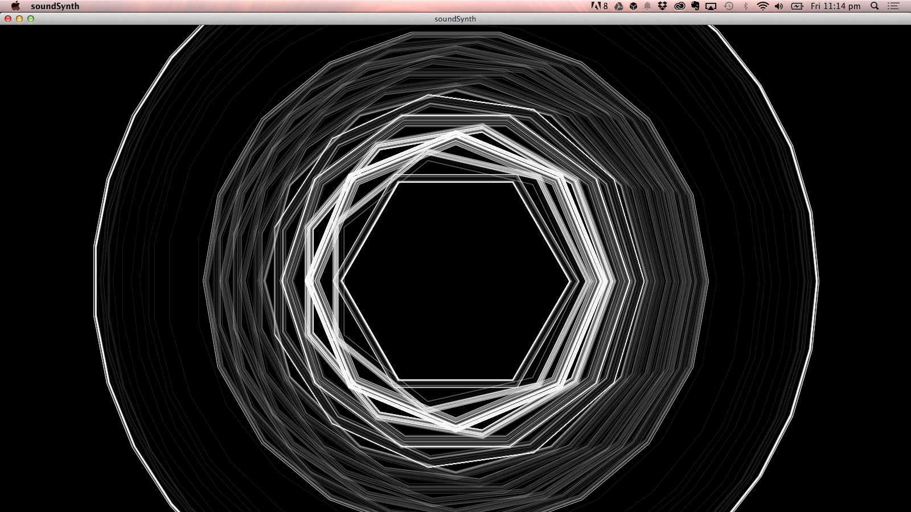
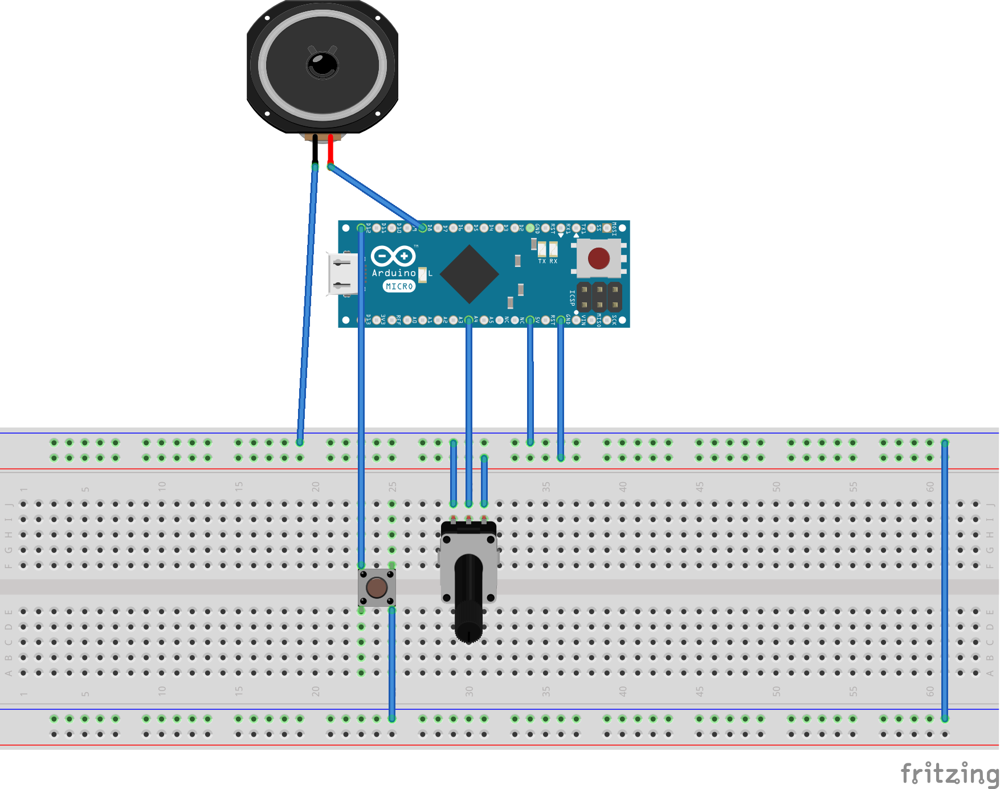

#####This is an arduino / processing project for making a one button synth drawing machine. 

It makes visual output that looks like this 
	

The audio output is crunchtastic analog synth and created with this simple circuit
 

######The materials you'll need are: 
* an Arduino micro
* a 10k potentiometer
* a small 3" Diameter - 8 Ohm 1 Watt speaker
* a push button
* jumper wires 
* a breadboard 
* and a microB usb cable

#####Sources: 
*Dutch: https://www.kiwi-electronics.nl/ 
*American: http://www.adafruit.com

There's also a little pdf and keynote hanging out in this repo. It's the notes for the workshop. 